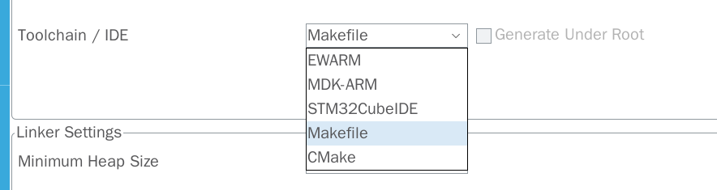

# 开发环境

对于 MCU （以 stm32 为例）开发，常有两种开发环境：
- IDE（推荐新手）
- 非 IDE（需要折腾）

## IDE

IDE 通常能提供 MCU 开发的一条龙服务，如：
- 代码编辑
- 编译
- 烧录
- 调试
- ...

> [!INFO]
> IDE 十分适合新手/不喜欢折腾的人士使用，可以只专注于代码的编写。

对于 STM32 开发，常用 IDE：
- Keil MDK
- STM32CubeIDE
- ...

对于 IDE 选择可以根据：

- 自己的喜好
- 开发板厂商提供的例程/教程所使用的 IDE（对于初学者来说这一点更重要）

## 非 IDE

对于不喜欢用 IDE 的人来说，非 IDE 开发嵌入式也有十分成熟的方案。

常用工具：
- vscode：代码编辑
- gcc：编译、反汇编
- gdb：调试
- openocd：烧录、调试
- make/cmake：辅助编译
- ...

以 STM32 为例，STM32CubeMX 工具能快速配置并生成代码框架，并导出成适合 make/cmake 编译的项目目录，再使用上述工具进行代码编写、编译、烧录以及调试。

这种方式比起 IDE 开发方式来说有更高的灵活性与可配置性，同时能更深入理解嵌入式开发流程的本质。
