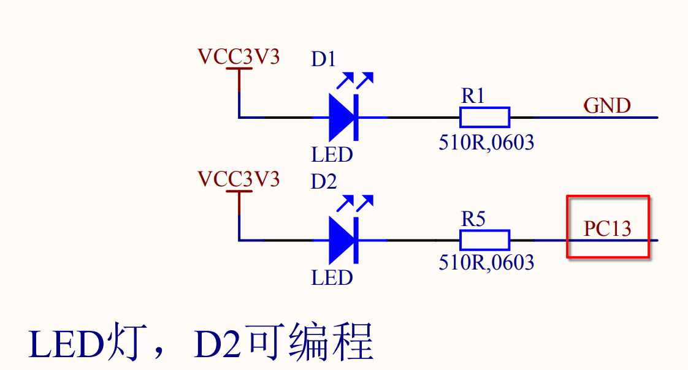
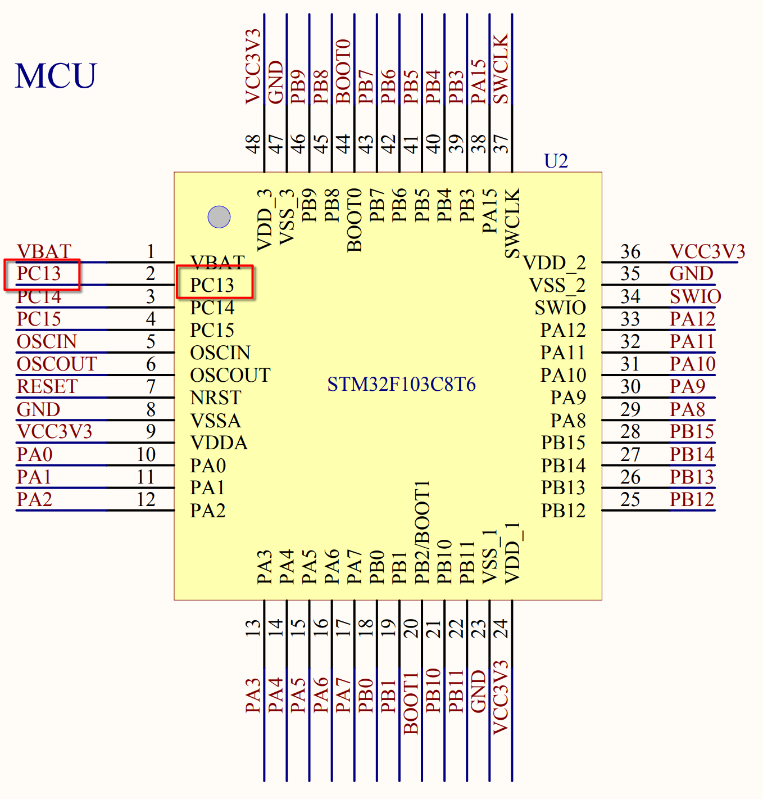

# 认识原理图

学习嵌入式需要能读懂原理图，明白主控与外设的连接方式。

> [!TIP]
> 入门学习原理图，我认为只需要重点关注两个部分：
> - 目标外设
> - 主控芯片

---

以 stm32f103 小蓝板为例，目标外设为板载 LED。

- 目标外设为 LED，在原理图 PDF 中搜索 LED，找到 LED 的原理图。
  
  从图中可以获取到的信息：
  - LED 的阳极接在了 3V3
  - LED 的阴极接在了 PC13

- 接下来在原理图中搜索 PC13，来寻找另一端的位置。

  可以看出 PC13 直接与 MCU 的 PC13 引脚相连。

> [!IMPORTANT]
> 因此，我们只需要编程**把 PC13 引脚拉低**就能把 LED 点亮了。

